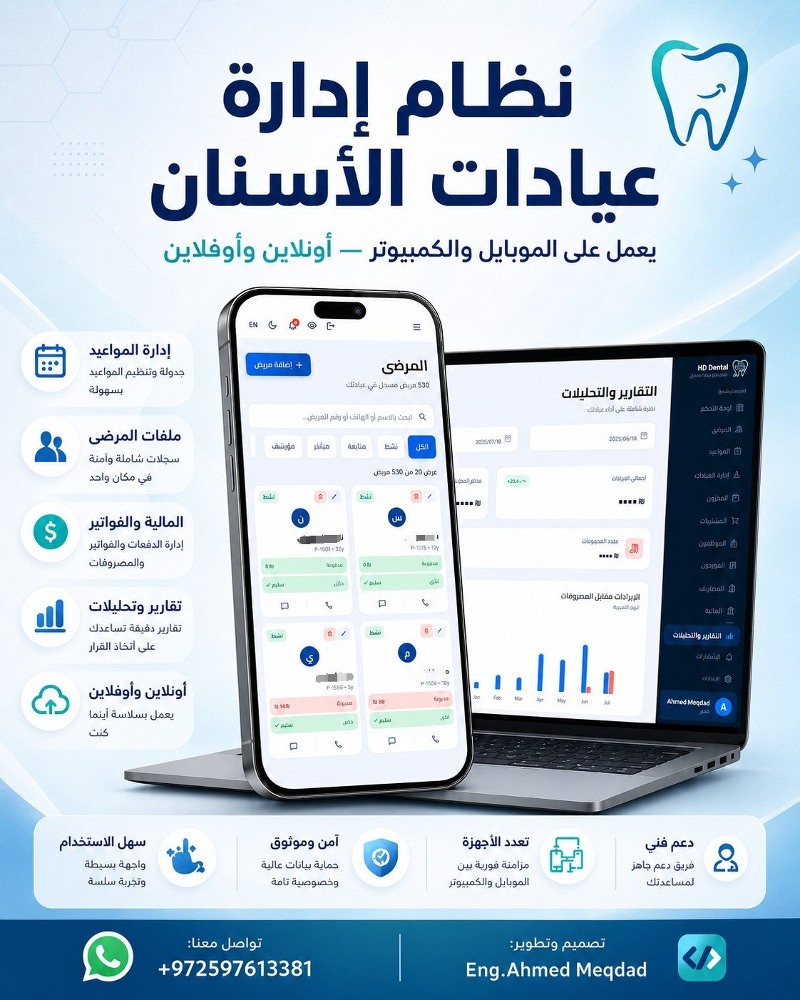
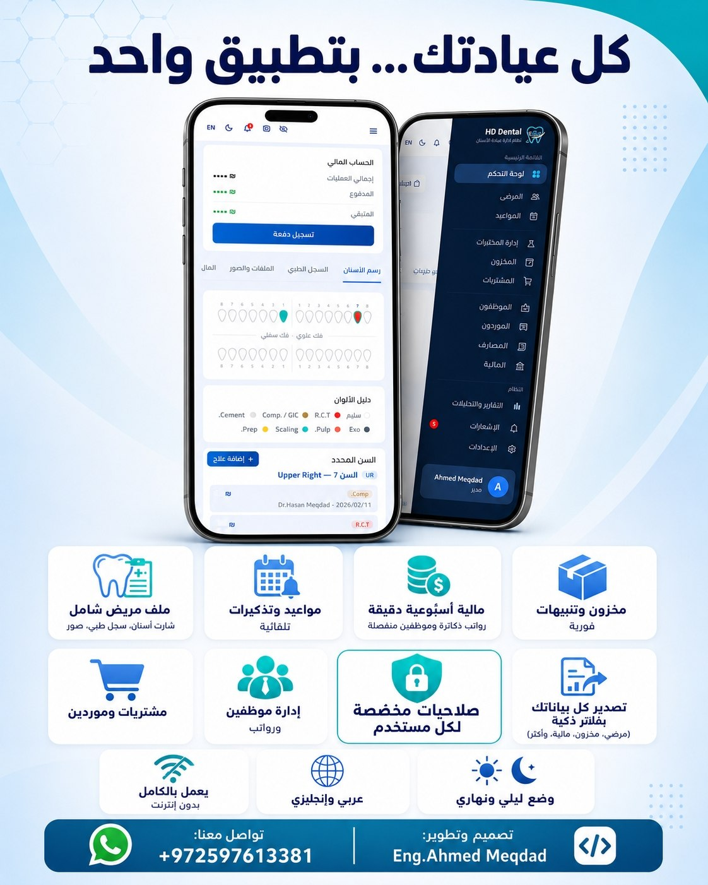

<div align="center">

# 🦷 HD Dental Clinic

**A full-stack, offline-first clinic management system built with Flutter**

Manage patients, appointments, finances, inventory, labs, staff and more — from a single, responsive app that runs on **Windows, Android, iOS, macOS and the Web.**


</div>

---

## 📖 Project Overview

**HD Dental Clinic** is a production-grade practice management application for dental clinics. It replaces spreadsheets and paper records with a single system covering the full clinical and business workflow: patient records and dental charting, appointment scheduling, treatment sessions and payments, inventory and lab orders, purchasing and suppliers, staff management with role-based permissions, and financial reporting with PDF/Excel export.

The app is **offline-first** — every screen keeps working without a connection, queues changes locally, and syncs automatically once connectivity returns — which matters for clinics with unreliable internet. It ships as a native desktop app for the front-desk Windows PC and as a mobile app for doctors and staff on the go, sharing one Dart/Flutter codebase and one Supabase backend.

The project has already been reused as a white-label build for a second clinic, confirming the architecture supports multi-tenant branding with minimal changes.

---

## 🛠️ Tech Stack

| Layer | Technology |
|---|---|
| **Framework** | Flutter 3 / Dart (SDK ^3.11.0) |
| **State Management** | Provider (`ChangeNotifier` + singleton `.instance` pattern) |
| **Backend / Database** | Supabase (Postgres, Auth, Storage, Realtime) |
| **Local / Offline Storage** | Hive (versioned local boxes) + custom sync queue |
| **Push Notifications** | Firebase Cloud Messaging + `flutter_local_notifications` |
| **Routing** | Custom `onGenerateRoute` route guard (with `go_router` available) |
| **Networking** | `dio`, `supabase_flutter`, `connectivity_plus` |
| **Documents / Exports** | `pdf`, `printing`, `excel` (PDF & Excel invoice/report generation) |
| **Charts** | `fl_chart` (revenue & dashboard analytics) |
| **Localization** | `easy_localization` (Arabic 🇸🇦 / English 🇬🇧, RTL-aware) |
| **Fonts / Theming** | Custom design system with the **Cairo** font family, light & dark themes |
| **In-app Updates** | `upgrader` driven by a self-hosted GitHub Releases `appcast.xml` feed |
| **Persistence utilities** | `shared_preferences`, `path_provider`, `file_picker`, `image_picker`, `open_filex` |
| **Tooling** | `flutter_launcher_icons`, `flutter_native_splash`, `build_runner`, `drift_dev` |
| **CI-friendly** | `flutter_lints`, `flutter_test` |

---

## 🏗️ Architecture

The app follows a **feature-first, layered architecture**:

```
lib/
├── core/        → cross-cutting concerns: auth, theming, notifications, services, shared widgets
├── data/        → global models & repositories shared across features
├── features/    → one folder per business domain (self-contained: data + providers + widgets + screen)
├── providers/   → app-wide providers (e.g. ThemeProvider)
└── shared/      → shared layout shell (sidebar, topbar, responsive scaffolding)
```

**Key architectural decisions:**

- **Offline-first sync** — `HiveService` caches every entity in versioned local boxes (`patients_v2`, `finance_v2`, …). Writes made offline are queued by `SyncQueueService` as `create` / `update` / `delete` operations and replayed against Supabase in order once `ConnectivityService` reports the device is back online. Permanently-invalid queue items (schema/FK errors) are dropped automatically instead of blocking the queue.
- **Role-based access control (RBAC)** — `PermissionService` resolves a user's role (`owner`, `admin`, `doctor`, `receptionist`, `assistant`) plus per-user permission overrides loaded from Supabase, and `PermissionGuard` / `PermissionGuardOf` widgets conditionally render UI based on those permissions.
- **Session & route guarding** — `AuthProvider` drives a single initial route (avoiding duplicate back-stack entries) and an `onGenerateRoute` guard redirects unauthenticated users away from protected routes.
- **Responsive, adaptive UI** — the same codebase renders a sidebar/topbar desktop shell on wide (Windows) layouts and an adaptive mobile layout on narrow screens, with different page-transition curves for each.
- **In-app self-updating** — the Windows/Android builds check a GitHub-hosted `appcast.xml` feed and can download & install updates from directly inside the Settings screen.
- **Localization-first** — every screen is wrapped for `easy_localization` with full Arabic/English support and RTL layout handling.

---

## ✨ Features

- 📊 **Dashboard** — real-time stats, weekly revenue chart, today's schedule, latest invoices, and patient-debt alerts
- 🧑‍⚕️ **Patients** — full patient records, interactive dental chart (custom tooth painter), treatment history, notes, files, and financial/payment sessions
- 📅 **Appointments** — weekly calendar view, day-detail list, and a booking dialog
- 💰 **Finance** — payment tracking, PDF & Excel invoice/report export, doctor-scoped views for RBAC
- 🧪 **Labs** — lab order tracking and management
- 📦 **Inventory** — stock items, batch tracking, and consumption logging
- 🧾 **Purchases & Purchase Returns** — supplier purchase invoices and returns
- 🏢 **Suppliers** — supplier directory and management
- 👥 **Staff** — staff accounts with granular, per-user permission overrides
- 🧮 **Expense Invoices** — clinic expense tracking by type
- 📈 **Reports** — consolidated clinic reporting
- 🔔 **Notifications** — in-app + push notifications (FCM) with deep-link navigation
- ⚙️ **Settings** — clinic settings, payment accounts, account transfers, data export, in-app updates
- 🌗 **Dark / light theme** and 🌍 **Arabic / English** localization
- 📴 **Full offline support** with automatic background sync
- 🖥️ **Multi-platform** — Windows desktop, Android, iOS, macOS, Web

---

## 🧪 Testing

The project uses Flutter's built-in `flutter_test` framework:

```bash
flutter test
```

Current test coverage includes:

| Test file | What it covers |
|---|---|
| `test/widget_test.dart` | App smoke test — verifies `SunnClinicApp` builds and renders without exceptions |
| `test/settings_screen_test.dart` | Widget test verifying `SettingsScreen` renders correctly under `ThemeProvider` |

> 💡 **Note:** Test coverage is currently minimal (smoke/widget-level). See [Future Improvements](#-future-improvements) for planned expansion.

---

## 📁 Folder Structure

```
dental_management_app/
├── android/ ios/ macos/ web/ windows/    # Platform-specific projects
├── assets/
│   ├── icons/                            # App icons, splash images
│   └── translations/                     # ar.json / en.json (easy_localization)
├── lib/
│   ├── app.dart                          # Root widget, route guard, page transitions
│   ├── main.dart                         # Entry point / service initialization
│   ├── firebase_options.dart             # Generated Firebase config
│   │
│   ├── core/
│   │   ├── auth/                         # AuthProvider, PermissionService, PermissionGuard
│   │   ├── config/                       # Supabase configuration
│   │   ├── constants/                    # App routes
│   │   ├── notifications/                # FCM token + local notification services
│   │   ├── providers/                    # Privacy provider
│   │   ├── service/                      # Hive, sync queue, connectivity, app-update services
│   │   ├── theme/                        # Colors, dimensions, text styles, ThemeData
│   │   ├── utils/                        # Excel saver, platform utils, helpers
│   │   └── widgets/                      # Shared reusable widgets
│   │
│   ├── data/
│   │   ├── local/                        # Local database layer
│   │   ├── models/                       # Shared data models
│   │   ├── remote/                       # Supabase client wrapper
│   │   └── repositories/                 # Shared repositories
│   │
│   ├── features/                         # One folder per business domain, e.g.:
│   │   ├── appointments/
│   │   ├── auth/
│   │   ├── dashboard/
│   │   ├── expense_invoices/
│   │   ├── finance/
│   │   ├── inventory/
│   │   ├── labs/
│   │   ├── notifications/
│   │   ├── patients/                     # data/ · providers/ · widgets/ · screens
│   │   ├── purchases/
│   │   ├── reports/
│   │   ├── settings/
│   │   ├── staff/
│   │   └── suppliers/
│   │
│   ├── providers/                        # App-wide providers (ThemeProvider)
│   └── shared/layout/                    # AppShell, sidebar, topbar
│
├── supabase/                             # Supabase project config
├── test/                                 # Widget tests
├── appcast.xml                           # In-app update feed (GitHub Releases)
├── firebase.json                         # FlutterFire configuration
└── pubspec.yaml                          # Dependencies & app metadata
```

---

## 🚀 Future Improvements

- [ ] Expand automated test coverage (unit tests for providers/repositories, integration tests for the sync queue)
- [ ] Migrate raw Hive JSON boxes to a structured local database (`drift` is already a dev dependency) for type-safety and easier migrations
- [ ] Add CI/CD pipeline (GitHub Actions) for automated builds, linting, and release publishing to the `appcast.xml` feed
- [ ] Conflict-resolution strategy for the offline sync queue when the same record is edited on two devices
- [ ] Publish the iOS and macOS builds (currently configured but not actively distributed)
- [ ] Multi-clinic / multi-tenant support as a first-class configuration option (currently done via white-label rebuilds)
- [ ] Richer analytics & reporting (trend comparisons, exportable dashboards)
- [ ] Encrypted local storage for sensitive patient data at rest

---

## 📸 Screenshots

<div align="center">




</div>

> Replace the placeholders above with real screenshots (e.g. `docs/screenshots/dashboard.png`) once available.

---

## 🔗 Social Links

<div align="center">

[](https://github.com/a7med2002)
[](https://LinkedIn.com/ahmedmeqdad0)
[](#)

*(Update the LinkedIn and Email links above with your own profile URLs.)*

</div>

---

<div align="center">

Built with ❤️ using Flutter & Supabase

</div>
